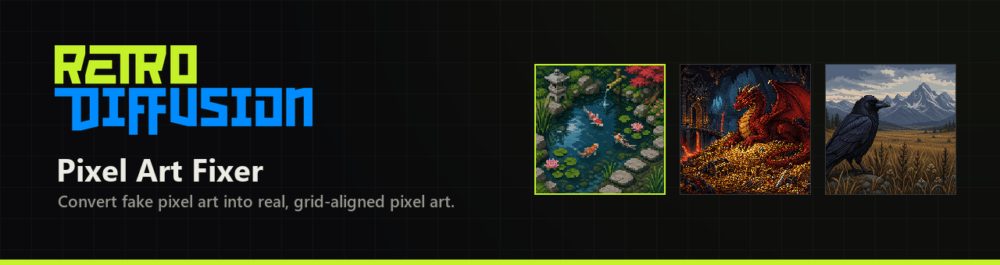
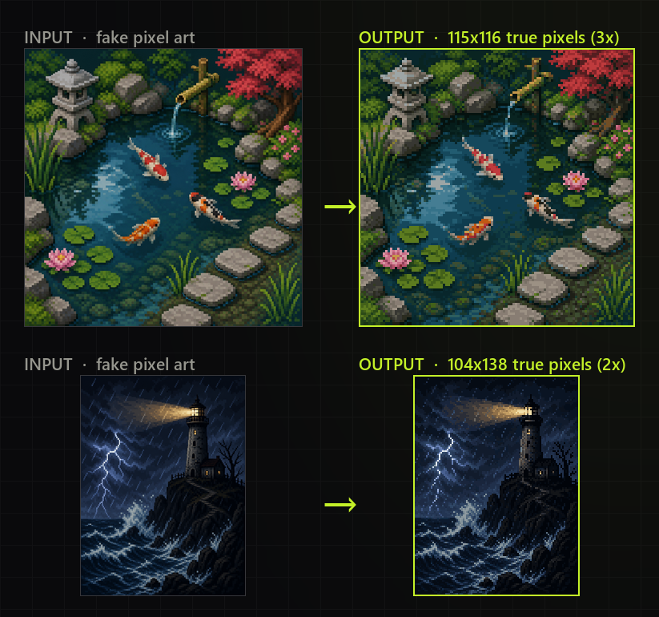
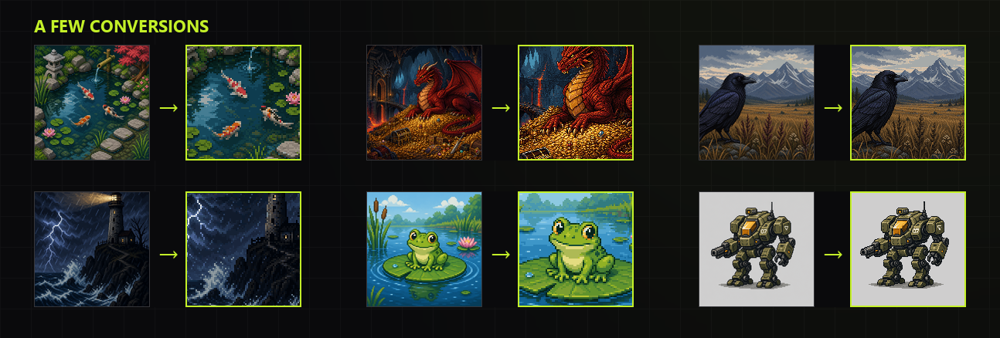
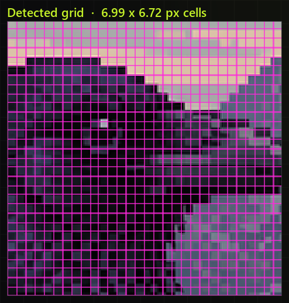
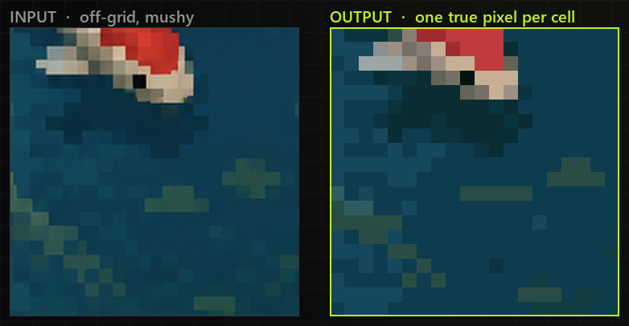
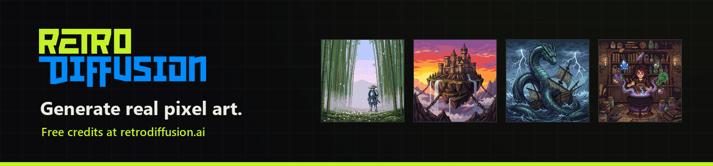

# Pixel Art Fixer



Convert fake "pixel art" into real, grid-aligned pixel art. Image processing only, no model required.

### ➜ [**Try the Pixel Art Fixer on Retro Diffusion**](https://retrodiffusion.ai/pixel-art-fixer)

No install, no setup. Drop an image in your browser and get true pixel art back, free.



Image generators, upscalers, and lossy pipelines happily produce pictures that
*look* like pixel art but aren't. The "pixels" drift off the grid, blur into
their neighbors, sit at some awkward non-integer size, and the file is stored at
10x the resolution the art actually contains. Pixel Art Fixer recovers the
pseudo-pixel grid those images were drawn on and rebuilds each cell as exactly
one true pixel, at the native resolution the art was always meant to be.

It is built and maintained by [Retro Diffusion](https://retrodiffusion.ai), the
AI pixel art generator designed by working pixel artists.

## The problem

A "true" piece of pixel art is a small grid of deliberate, hand-placed pixels.
"Fake" pixel art is anything that imitates the look without the structure:

- **Off-grid cells.** The implied pixels don't line up to a clean lattice, and
  the grid often drifts in scale across the image.
- **Non-integer cell size.** A cell might be 6.38 pixels wide, not 6, so no
  simple integer downscale lands on it.
- **Mush and anti-aliasing.** Cell edges are blurred, dithered, or smeared by
  bilinear resampling, so there are no crisp boundaries to snap to.
- **Wrong resolution.** A 32x32 sprite arrives as a 1024x1024 PNG with thousands
  of near-duplicate colors and no clean alpha.
- **Compression damage.** JPEG's 8x8 block lattice fights the real art grid.

None of these can be tiled, palette-swapped, animated, or edited pixel by pixel
until they are converted back to real pixels.

## Why existing tools fall short

- **Naive nearest-neighbor or fixed-integer downscaling** assumes one global,
  integer-sized cell and a phase-0 origin. Real fake-pixel-art violates all
  three assumptions, so a fixed grid slices straight through cells.
- **"Pixel snapper" utilities** detect a single dominant period and snap to it.
  That period is very often the *content* scale (a sprite, a texture, a face),
  not the pixel scale, and it is just as often an octave off (2x or 1/2 the
  truth scores nearly as well as the truth itself).
- **Single-heuristic detectors** are brittle: whichever cue they rely on
  (edges, autocorrelation, FFT peak) fails on a different class of image, and
  patching one class silently regresses another.

## Why Pixel Art Fixer is state of the art

Within the space of traditional (non-neural) image processing, this is the most
robust converter available:

- **Multiple independent detectors, then consensus.** Three cheap,
  phase-invariant detectors (autocorrelation, run-length combs, shift
  self-similarity) vote first. When they agree, that is the answer. They fail on
  *different* images, so agreement is strong evidence.
- **Principled arbitration when they disagree.** A fused evidence stack
  (spectral, tile-Rayleigh, within-cell variance, and a round-trip
  "distillability" score) resolves the hard cases per axis, with explicit rules
  for the failure modes that break naive tools: octave/harmonic traps,
  content-scale-versus-pixel-scale, and cross-axis disagreement.
- **Handles what fixed grids can't.** Non-integer cell sizes, sub-pixel drift,
  warped and non-uniform grids, heavy anti-aliasing, and JPEG block artifacts
  are all first-class cases, not afterthoughts.
- **Reconstruction that preserves detail.** Once the grid is known, cells are
  pooled with border-aware, center-weighted sampling that resists the bleed
  living at cell edges, keeping single-pixel outlines and rare local colors.
- **Verified and fast.** Every result is checked against a graded ground-truth
  benchmark. The Rust core is 11-24x faster than the reference at 2.5-4x lower
  memory, converting a typical image in well under a second.



There is a limit to what pure image processing can recover from a badly damaged
image. For the hardest inputs, [the neural version](#the-neural-version) picks
up where this leaves off.

## Table of contents

- [Usage](#usage)
  - [Python](#python)
  - [Rust](#rust)
  - [Options and output](#options-and-output)
- [The neural version](#the-neural-version)
- [How it works](#how-it-works)
  - [Pipeline overview](#pipeline-overview)
  - [Grid detection: the evidence channels](#grid-detection-the-evidence-channels)
  - [Consensus and arbitration](#consensus-and-arbitration)
  - [Reconstruction](#reconstruction)
  - [Why this beats naive methods](#why-this-beats-naive-methods)
- [Made by Retro Diffusion](#made-by-retro-diffusion)
- [License](#license)

## Usage

Two implementations live in this repository. They produce the same answers; pick
by context.

- **[`python/`](python/)** is the reference: clearest to read, easiest to hack
  on and extend.
- **[`rust/`](rust/)** is the native core: one dependency-free binary, 11-24x
  faster, for servers and batch jobs.

### Python

Requires Python 3.9+ and `numpy`, `scipy`, `opencv-python`, and `Pillow`.

```bash
cd python
pip install -r requirements.txt
```

Run the CLI on an image:

```bash
python -m pixelfixer.cli input.png                    # print detection JSON
python -m pixelfixer.cli input.png --extract out.png  # write the fixed pixel art
python -m pixelfixer.cli input.png --overlay grid.png # write a grid overlay
python -m pixelfixer.cli folder/ --json results.json  # batch a folder
```

Or call it from Python:

```python
import numpy as np
from PIL import Image
from pixelfixer import detect
from pixelfixer.reconstruct import reconstruct

rgba = np.array(Image.open("input.png").convert("RGBA"))
r = detect(rgba)                       # {step_x, step_y, cols, rows, consensus, ...}
out = reconstruct(rgba, r["step_x"], r["step_y"], r["cols"], r["rows"])
Image.fromarray(out).save("out.png")   # true pixel art at r["cols"] x r["rows"]
```

A single-call server entry point takes bytes in and returns PNG bytes out:

```python
from pixelfixer.api import process

result = process(png_or_jpeg_bytes)               # full quality
result = process(png_or_jpeg_bytes, mode="fast")  # bounded latency
# result: cols, rows, step_x, step_y, consensus, confidence, png (bytes), timings
```

### Rust

Requires a stable Rust toolchain. No system libraries, no OpenCV, nothing to
install beyond `cargo`.

```bash
cd rust
cargo build --release        # -> target/release/pixelfixer
```

```bash
# detect + reconstruct, writing the fixed image
./target/release/pixelfixer process input.png output.png        # full mode
./target/release/pixelfixer process input.png output.png fast   # fast mode

# detection only (no output file), one JSON line per image
./target/release/pixelfixer full  input.png
./target/release/pixelfixer fast  input.png
```

`process` prints one JSON line with the detected size, cell steps, decision
path, and timings:

```json
{"file": "input.png", "cols": 104, "rows": 138, "step_x": 10.44,
 "step_y": 10.49, "consensus": "fast:ac+rl(S)", "mode": "full",
 "detect_s": 0.19, "recon_s": 0.11, "peak_rss_mb": 147.6}
```

### Options and output

- **Modes.** `full` (default) runs the complete arbitration for best accuracy.
  `fast` runs only the cheap detectors for bounded latency, flagging low
  confidence when they disagree.
- **The output is 1x pixel art.** It is often tiny (for example 64x64). Display
  it with nearest-neighbor scaling only (`image-rendering: pixelated` in CSS,
  `imageSmoothingEnabled = false` on a canvas). `cols` and `rows` in the JSON
  tell you the size without opening the file.
- **Confidence.** The `consensus` string records the decision path:
  `fast:...` (the cheap detectors agreed, high confidence), a `+`-joined method
  list (a supermajority vote), or `arbitrated` (the evidence stack decided).
- **Input limits.** PNG and JPEG, minimum side 16 px, maximum 4 megapixels.
  Transparency is preserved as the per-cell majority.

## The neural version

This open-source tool is the best you can do with classical image processing,
and it clears the great majority of real inputs. But some images are damaged
past what any grid detector can recover: extreme jitter with no boundary
lattice left, cells under about 3 px, or heavy dithering that hides the true
step.

For those, Retro Diffusion hosts a **neural Pixel Art Fixer**, free to use:

### [Try the Pixel Art Fixer on retrodiffusion.ai](https://retrodiffusion.ai/pixel-art-fixer)

The neural engine is trained on real pixel art rather than measuring a grid. It
solves more edge cases, reconstructs detail and palettes this algorithm has to
approximate, and restores clean alpha where the classical pipeline can only pool
what is there. It runs right in the browser, no signup required, and is
exclusive to retrodiffusion.ai. The two share a design goal: real pixels out,
ready for a game.

## How it works

### Pipeline overview

Conversion is two decoupled halves:

1. **Grid detection** (`detect`) finds the pseudo-pixel cell size per axis
   (`step_x`, `step_y`, sub-pixel), the native output resolution
   (`cols`, `rows`), and a `consensus` string recording how it decided.
2. **Reconstruction** (`reconstruct`) takes that grid and collapses the source
   down to the native true-pixel image.

Detection is the hard part, and the whole architecture exists to defeat four
specific failure classes: octave/harmonic ambiguity (a 2x or 1/2 answer that
scores almost as well as the truth), content scale masquerading as pixel scale,
miscounting under grid drift, and the regressions that come from piling up
one-off heuristics.

### Grid detection: the evidence channels

The core problem is recovering the lattice when every "pixel" is a large,
mushy, warped, or compression-damaged block. Each of the following channels
measures periodicity through an independent physical signal, so they fail on
different images.



Three cheap, phase-invariant detectors run first:

- **Autocorrelation (`autocorr.py`).** The lattice lives in boundary positions
  *shared across rows*, not in any single scanline. It projects edge and
  curvature features into row-bands, takes a banded autocorrelation, and scores
  candidate steps with a comb-minus-anti-comb score (reward periodicity at
  multiples of the step, penalize it at half-multiples). This is the precision
  leader, refined to sub-percent step error.
- **Run-lengths (`runlengths.py`).** Pixel art, even mushy, is made of runs.
  Distances between color-change boundaries are integer multiples of the cell
  size; a soft-GCD comb over those distances (with coherence smoothing so real
  boundaries that persist across scanlines are trusted) finds it. The fastest
  family, and its comb-peak height is a calibrated confidence.
- **Self-similarity (`selfsim.py`).** An image re-aligns with itself when
  shifted by a whole cell, so the shift-dissimilarity curve dips at multiples of
  the step. A comb t-statistic beats odd-harmonic aliasing, and
  dispersion-adaptive tile voting handles grids that drift across the image.

When the cheap detectors disagree, a heavier evidence stack arbitrates:

- **Fused spectral and tile channels (`fusion.py`, `channels.py`).** An
  equal-weight sum of the channels that empirically rank the true step best:
  tile-local Rayleigh phase-coherence on gradient and curvature maps, a Welch
  spectral score (phase-free, strongest on pure mush), and global Rayleigh
  coherence.
- **Within-cell variance contrast (`varcontrast.py`).** A grid is correct when
  cells are internally uniform. This "square packer" scores how much more
  homogeneous cells are at the best phase than the worst, computed from summed
  area tables. It carries the signal on images so mushy that no edges survive at
  all.
- **Distillability (`reconsearch.py`).** The octave arbiter. It measures what
  downscaling at each candidate size would destroy, using the identity that a
  box-downscale then upscale round-trip error equals total within-cell variance.
  A two-factor score (an anti-phase term plus an octave killer) separates the
  true fundamental from its harmonics, which is the single biggest failure class
  for naive detectors.

### Consensus and arbitration

Detection is consensus-first, in layers:

1. **Calibrated early exit.** If autocorrelation and run-lengths agree on the
   size and the run-length comb height clears a level that was always correct on
   the benchmark, return immediately (`consensus: "fast:ac+rl(S)"`).
2. **Supermajority.** After a fourth, fused-argmax voter is added, if three or
   more methods agree on a size with a sane aspect ratio, take it. Two of four
   is deliberately *not* enough: the methods share some content and texture
   locks, so a bare majority can be a correlated failure.
3. **Per-axis arbitration.** With no supermajority, each axis is scored over a
   candidate pool (every method's step plus autocorrelation's top peaks). The
   score sums the fused evidence, the variance-contrast weight, an agreement
   bonus, and the distillability term, with a penalty on steps larger than the
   detail scale. Among everything scoring near the best, the *smallest*
   qualifying step wins, the harmonic-hygiene rule all three cheap detectors
   converged on independently.
4. **Cross-axis reconciliation.** On wild axis disagreement it prefers the finer
   step on both axes (a too-fine grid subdivides losslessly; a too-coarse one
   destroys detail), and near-equal axes snap square.

`fast` mode runs only step 1 and the cheap detectors, for bounded latency.

### Reconstruction

Given the grid, reconstruction produces the native image:



1. **Phase solve.** Estimate the grid origin per axis from an edge comb, falling
   back to a variance-minimizing phase sweep when the image is too mushy for a
   comb.
2. **Cut placement.** Generate candidate cell boundaries (snapped to gradient
   maxima, phase-lattice, and plain lattice) and pick, per axis, the set that
   minimizes within-cell variance.
3. **Warp refinement.** Allow per-band non-uniform cuts for warped grids, but
   adopt them only when they measurably reduce within-cell variance, so straight
   grids are left untouched.
4. **Color pooling.** Sample each cell with triangular center weighting (mush,
   anti-aliasing, and JPEG bleed all live at cell borders) plus a crisp center
   sample, preserving single-pixel outlines and rare local colors a global
   codebook would erase.

### Why this beats naive methods

- A naive "strongest period" locks onto content, not pixels. This uses the
  *finest consistent* period and caps the step at the detail scale, so a 60 px
  cell cannot coexist with 3 px detail.
- A fixed integer grid assumes one global cell at phase 0. This handles
  non-integer cells, sub-pixel drift (per-window counting), and warped grids
  (per-band cuts).
- Octave traps, where 2x and 1/2 score nearly as well as the truth, are broken
  structurally by the distillability arbiter rather than by fragile thresholds.
- Smooth resampling erases first-difference edges; the signal moves into the
  second derivative, which the curvature feature maps track.
- JPEG's 8 px block lattice is detected and notched out before the channels see
  it, so compression is not mistaken for the art grid.

Full technical documentation, including every channel, rule, and the reasoning
behind them, is in [`docs/HOW_IT_WORKS.md`](docs/HOW_IT_WORKS.md).

## Made by Retro Diffusion



Converting fake pixel art is a repair job. The better move is to never make fake
pixel art in the first place.

[Retro Diffusion](https://retrodiffusion.ai) generates real, grid-aligned,
palette-controlled pixel art from the start: characters, tilesets, animations,
and game-ready sprites, built and trained by working pixel artists and designed
for game developers. No conversion step, because the pixels are real when they
come out. New accounts get free credits, there is no subscription, and credits
never expire.

**[Generate real pixel art at retrodiffusion.ai](https://retrodiffusion.ai)**

## License

MIT. See [LICENSE](LICENSE).
