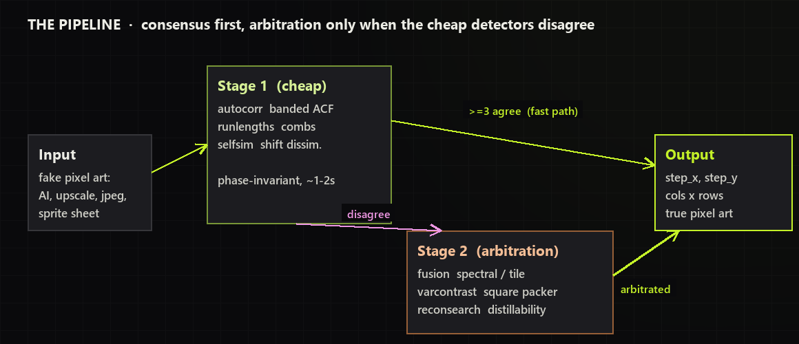
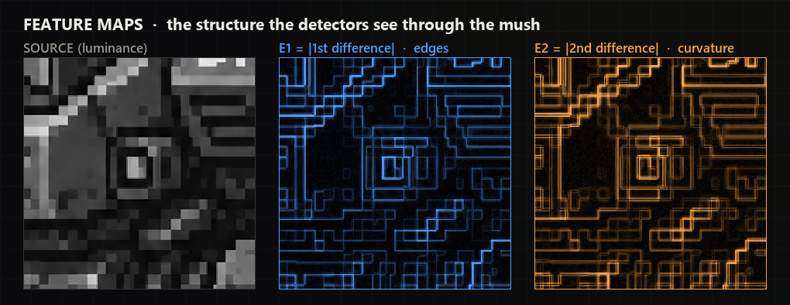
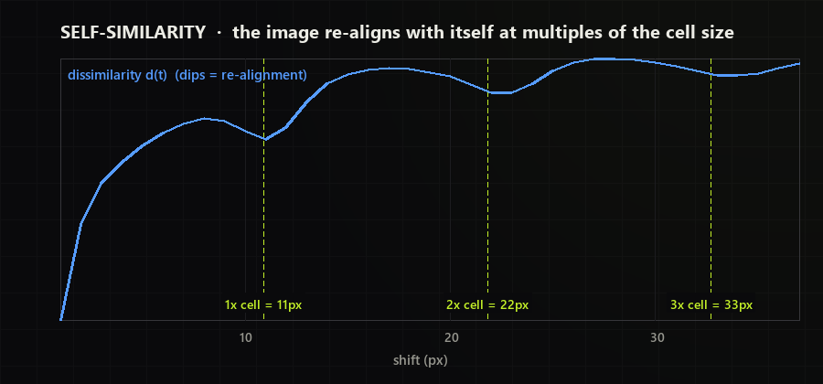
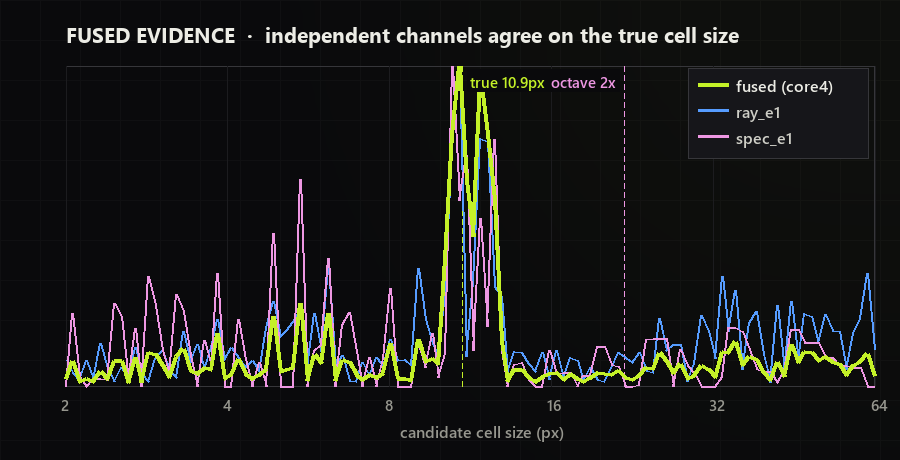
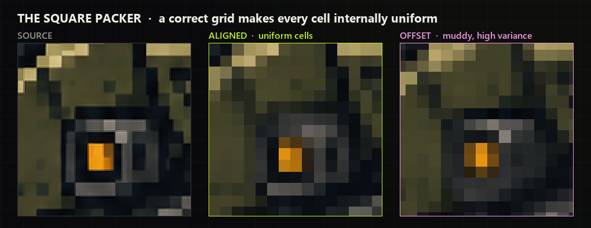
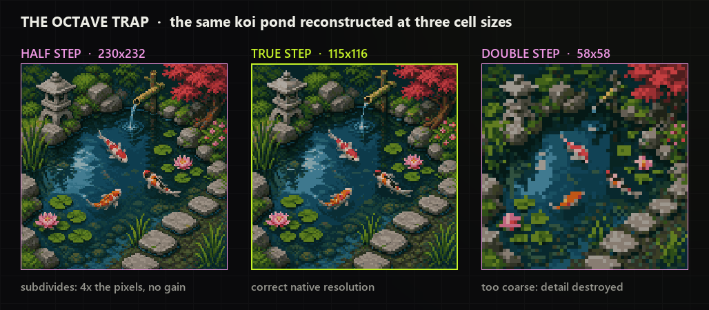
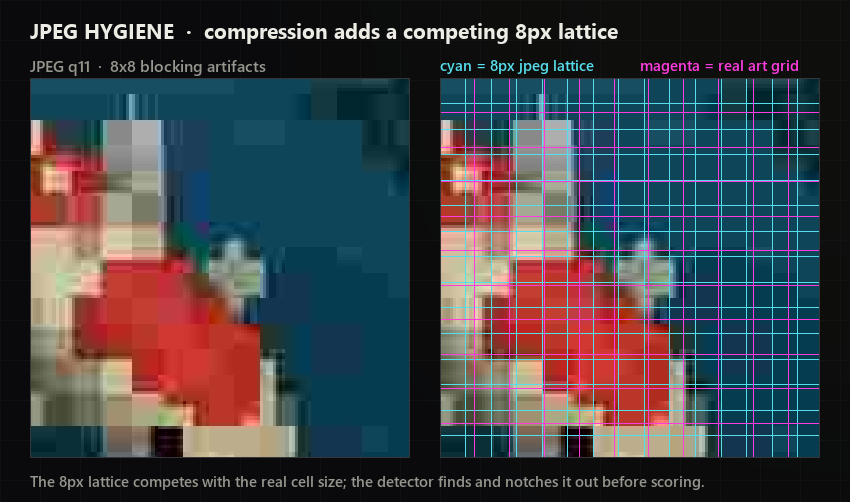

# How the pixel-art grid detector works

This document explains the grid detector end to end: the problem it solves, why
that problem is hard, the two-stage ensemble that solves it, and the reasoning
behind every non-obvious design choice. It is written for an engineer who will
maintain, extend, or port this code, so it favours the *why* over the *what*;
the source is the authority on the *what*.

The design choices below were settled empirically, by benchmarking each method
against a set of user-graded ground-truth images. Where a number is quoted (for
example "17 of 26 exact"), it is the score that decided the choice.

---

## 1. The problem

Input is an image that is *supposed* to be pixel art but is not stored as
native low-resolution pixels: an AI generation, a bad upscale, a sprite sheet,
a jpeg-crushed upload. The pseudo-pixels — the blocks a human reads as "one
pixel" — are large, and each one may be mushy, warped, anti-aliased, or
compression-damaged. The detector must recover the **pseudo-pixel grid**:

- **cell size per axis** (`step_x`, `step_y`), sub-pixel accurate;
- **output resolution** (`cols`, `rows`) — the native pixel dimensions the
  image should collapse to;
- optionally the grid **phase**, for downstream cut placement.

Cells are often near-square but genuinely are not always: `weird-pixels` is
confirmed `6.38 x 8.00`, `Test.png` is `4.0 x 6.0`. Square priors must stay
*soft*.

The ground truth is user-graded by **reconstruction quality of the final
output**, not by how the grid lines look. A grid that is one octave too coarse
produces a visibly worse downscale; a grid that is slightly too fine
reconstructs almost perfectly. This asymmetry drives several decision rules
later.


### 1.1 Why it is hard — the failure taxonomy

Every benchmark failure we saw falls into one of four classes. The detector is
architected around defeating them:

1. **Octave / harmonic ambiguity** (×2 or ÷2 of truth). *The dominant failure
   class.* A comb laid at twice the true step scores almost as well as the
   true step — every real cell boundary is still hit, just every other one.
   Content that repeats at small multiples of the pixel size (a 2-pixel
   checker, a sprite laid out every few cells) makes multiples score even
   higher. Divisors (half the true step) are equally treacherous: any phase
   subdivides a real cell, so a half-step "explains" the image too. Affected:
   the city, the cottage, the mech, `shuffle_hard`, `blocks_mush`, `rowjit`.
2. **Content-scale vs pixel-scale.** The strongest periodicity in the image is
   often *not* the pixel grid. The knight sheet has sprite structure
   at ~14.7 px that dwarfs its 2.83 px pixels; the city has 4.5 px
   texture sub-scale under 9.8 px pixels. Naive "pick the strongest period"
   locks onto the wrong scale.
3. **Count off-by-a-few under drift.** AI grids *drift in scale* across the
   image — the local pitch on the left differs from the right by several
   percent. A single global step, however precise, cannot summarise a drifting
   grid, so `cols = round(W/step)` lands 1–8 cells wrong. Affected: `ai_soup`,
   `drift_mush`, `noisy_blur`.
4. **Churn.** Historically, every time a channel or heuristic was added to fix
   one class it silently regressed a previously-solid case (`clean_x6p5`,
   `starfield warp`). A heuristic pile interacts unpredictably. This is why the
   final architecture is a **principled fusion layer** with an explicit fast
   path, not an ever-growing if-ladder.

Underneath all four sit the physical degradations that erase the signal:
bilinear/bicubic resampling (no gradient edges — the signal moves into the
*second* derivative), jpeg 8×8 block contamination, per-region phase shifts
(sprite sheets), and mush so heavy that no boundary lattice survives at all.


---

## 2. Architecture at a glance

```
detect(rgba)
  │
  ├─ Stage 1  three cheap, phase-free detectors (~1-2 s total)
  │     autocorr  banded ACF + comb-anticomb + peak-train LS
  │     runlengths  multi-lag boundary-distance combs
  │     selfsim   shift-dissimilarity with tile voting
  │        │
  │        └─ if ≥3 agree on output size (and aspect is sane) → return   ← fast path
  │
  └─ Stage 2  arbitration (only on real disagreement, 15-37 s on big images)
        fusion   sum-fused evidence curves (4 measured-best channels)
        varcontrast  square-packer within-cell variance contrast
        reconsearch  distillability score — the octave arbiter
           │
           └─ per-axis candidate pool, scored, with the decision rules in §5
```



The consensus-first design comes straight from the scoreboard: the four
prototype families (`autocorr`, `runlengths`, `fusion`, `selfsim`) each score
~16–17/26 exact but **fail on different images** — the oracle union is 18
exact / 26 near, i.e. *every* bench image is solved by at least one family.
Consensus turns that complementarity into accuracy; arbitration only runs when
they genuinely disagree, which is where the hard cases live.

The four families share one design theme: **phase invariance**. AI pixel art
has per-region phase shifts (each sprite on a sheet starts at a different
sub-cell offset) and slow drift. Any detector that assumes one global grid
phase breaks on sprite sheets. All three Stage-1 detectors are constructed to
be phase-blind; Stage-2 evidence is either phase-free (spectral) or
locally-phased (tiles).

The detector's whole job is to recover the lattice below, then hand it to
reconstruction. The magenta lines are the detected cell boundaries.


---

## 3. Stage 1 — the fast path

Three detectors, each attacking periodicity from a different physical angle so
their failures do not correlate. `core.detect` runs all three, and if the
three cheap detectors agree on the output size within `max(1 cell, 1%)` and the
aspect ratio is sane (`|log((cols/rows)/(w/h))| < 0.35`), it returns the median
counts immediately (`core.py` lines 69–78). No fusion, no arbitration. On clean
synthetics this path resolves in 1–2 s.

### 3.1 autocorr — banded autocorrelation (`autocorr.py`)



*Family: translation-invariant period estimators (ACF / cepstrum).*
Score: **17/26 exact, 24 near, 0.08% median step error, ~0.7 s/img** — the
precision leader.

The key insight is a dead end turned inside out. Per-line autocorrelation of a
mushy image shows *no* lattice peaks: within-cell colours are random from cell
to cell, so each scanline's ACF is just the cell-width triangle. **The lattice
lives in boundary positions shared across rows, not in any single row.** So:

1. **Feature maps** that survive smooth resampling: `|2nd difference|` of
   luminance (impulses at the piecewise-linear knots even for bilinear/bicubic
   ramps, where the 1st difference is flat) plus `0.7 × |1st difference|` of
   median-quantised luminance (handles sharp nearest-neighbour upscales). The
   median+12-level rounding is a cheap stand-in for k-means quantization and
   tested just as well.
2. **Row-band projection before the ACF** (`band_profiles`): sum the feature
   over bands of 12 / 24 / all lines. Boundary positions are shared within a
   band, so projection amplifies them over per-cell texture. This single change
   was "the biggest jump" in the agent's ablation (14/20 from a dead start).
   Multi-scale bands matter: the full projection helps globally-aligned images,
   small bands survive sprite-sheet phase shifts.
3. **Banded ACF** (FFT, zero-padded, unbiased), each band power-normalised so
   one busy band cannot dominate, averaged across bands → translation-invariant
   and robust to per-region phase.
4. **Comb-minus-anti-comb scoring** (`comb_score`): reward ACF mass at
   multiples `k·s`, subtract the "anti-comb" at half-integer multiples
   `(k±0.5)·s`, with `exp(-k/12)` lag weighting. A small averaged-cepstrum vote
   is added. **Subharmonic suppression at selection time only**: penalise `s`
   by `0.5 × max score of s/2…s/5` (applied to selection, not to the refined
   peak position — penalising the scored curve directly shifts peaks, e.g.
   256→258).

The anti-comb has a *structural caveat* that shapes the whole ensemble: it
**provably zeroes the true step `s` when `s/2` dither texture exists**, because
the anti-comb sample points land exactly on the `s/2` peaks. autocorr cannot
resolve this within one axis; §5's cross-axis reconciliation and the
square-packer exist partly to rescue it.

**Precision (§6 in short): peak-train least squares.** `train_quality` and
`refine_step_acf` find the actual ACF maximum near each `k·s0` (parabolic
sub-pixel), then robust-fit `peak_pos ≈ k·s` through the origin. This gives the
0.08% step error and is generic — it refines *any* channel's winning
candidate, and `core.py` applies it to the final arbitrated step.
`train_quality` (coverage-weighted inlier mass × `exp(-4·rms residual/s0)`) is
also a cheap fundamental-vs-alias discriminator: it broke the JPEG rational-
alias tie on `7wMfPN` (2.78 vs 3.126 px, comb margin only 0.6%).

### 3.2 runlengths — boundary-distance combs (`runlengths.py`)

*Idea: pixel art, even mushy, is made of RUNS.* Score: **17/26 exact, 23 near,
0.25% step error, 0.3 s/img** — the fastest family.

Along a scanline the distances between consecutive colour-change boundaries are
approximately integer multiples of the cell size `s`. Pool those distances and
score candidate steps with a soft-GCD comb `S(s) = mean_r cos(2π·r/s)`: every
distance that is a multiple of `s` contributes +1, off-lattice distances
cancel. Completely phase-free.

Two ideas make it work on degraded art:

- **Perpendicular coherence smoothing** (`COHERENCE = 7`): a 1×7 box filter on
  the gradient *across* scanlines before NMS. Real cell boundaries persist for
  at least a cell of scanlines; jpeg/noise edges do not. Biggest single
  preprocessing win: 7→10/20 exact, and it kills incoherent jpeg edges.
- **Multi-lag distance pooling** (`MAX_LAG = 4`): a spurious mid-cell boundary
  splits a run into off-lattice halves at lag 1, but lag 2 jumps across it and
  lands back on the `k·s` lattice. The lag-1 run mode is systematically biased
  on mush; higher lags are not. This took the bench 10→15/20 exact.

Divisor aliases (`s/2`, `s/3` divide every multiple of `s` too) are resolved by
(a) noise asymmetry — a residual `ε` costs phase `2π·ε/s`, so the *smaller*
alias decays faster — and (b) an explicit rule: **"prefer the largest peak
within 0.70 of the max that has ≥4% run mass at 1·s"** (fundamental support).
The 0.70 ratio can be generous because larger *false* steps are anti-phase for
odd multiples of the true step (`cos(π·odd) = -1`) and score far below it.

Refinement is a fine comb search plus **k-weighted least squares** of `r ≈ k·s`
(long baselines average out boundary-position noise; the `k=1` mode is the
bias-prone one). Calibrated confidence: comb peak height `S ≥ 0.3` was *always*
correct on the bench; `S < 0.1` means no boundary lattice exists — fall back to
variance channels.

k-means label boundaries were tried instead of gradient NMS and gave ~3× lower
comb SNR (0.18 vs 0.51 on the raven); rejected.

### 3.3 selfsim — shift self-similarity (`selfsim.py`)



*Signal: `d(t) = mean|F(x) − F(x+t)|` per axis has minima at `t = k·s`.*
Score: **16/26 exact, 19 near, 0.19% step error**.

For a grid of cell size `s`, the image re-aligns with itself under a shift of
`k·s`, so the dissimilarity curve dips at multiples of the step and peaks near
half-offsets. `d(t)` is phase-free, so sprite sheets and row jitter cost
nothing.

Findings that shaped it:

- **Raw RGB `d(t)` is useless** — a featureless monotone trend (0/20 exact).
  Gradient-family features carry the whole signal: an ensemble of `|grad|`,
  blurred `|grad|`, and `|Laplacian|` after blur (clean/NN, AI-soup/noisy, and
  mush/jpeg/bicubic respectively). Single features score 9–10; the ensemble 16.
- **Odd harmonics score as high as the fundamental** (half-offsets of odd
  multiples also land on maxima), so naive argmax picks 3–5× the true step. The
  fix is a **comb t-statistic** (`_comb_tstat`): consistency of the comb
  contrast across many harmonics `K` wins over one deep content-period minimum,
  times a few-harmonic penalty `min(1,(K-1)/3)` that kills spurious 2-harmonic
  peaks at large `p`.
- **Content periodicity is the top confounder** — the pixel grid is the
  *finest consistent* period, not the strongest. Selection takes the smallest
  qualified peak (score ≥ `max(0.40·max, 4.0)`) then walks divisors.
- **Drift needs harmonic-mean voting.** Per-fine-tile votes around the selected
  period; if their dispersion is below `DISP_UNIFORM = 0.015` the grid is
  uniform (weighted median + harmonic LS sub-pixel refine), otherwise it is
  drifting and the answer is the area-weighted **harmonic mean** of local
  periods (`cols = Σ width_i/s_i`, so `1/s` averages linearly). This took the
  synthetic drift/warp family from BAD to exact/near.

Note the **common theme across all three**: banded ACF, boundary-distance
combs, and shift-dissimilarity are all *phase-invariant by construction*, and
all three independently converged on **smallest-qualified-peak selection**,
**divisor/harmonic hygiene**, and **per-tile drift integration**. Those shared
conclusions are lifted into the arbitration layer as first-class rules.

---

## 4. Stage 2 — the evidence stack

When fewer than three cheap detectors agree (or the aspect check fails),
`core.py` builds an evidence stack and arbitrates per axis. Three independent
evidence sources feed the decision, each covering a blind spot of the others.

### 4.1 Fused evidence curves (`fusion.py` + `channels.py`)



This is the fourth voter, but it is *also* the arbitration's fused-score
function. The fusion study instrumented **11 periodicity channels** across the
whole bench and measured how often each channel's argmax
lands on the true step. The ranking (top-1 accuracy over 52 known-truth axis
scans) is the empirical justification for which channels are used:

| channel | top-1 | med rank | what it is |
|---|---|---|---|
| `tile_e1` | **0.69** | 1.0 | 2D-tile Rayleigh on the quantized gradient map |
| `spec_e1` | **0.67** | 1.0 | Welch spectral z on the same gradient map |
| `band_e1` | 0.62 | 1.0 | per-band Stouffer combo |
| `tile_e2` | 0.62 | 1.0 | 2D-tile Rayleigh on the curvature map |
| `ray_e1` | 0.56 | 1.0 | global Rayleigh peak coherence |
| … | | | |
| `comb_e1` (global comb z) | **0.37** | 7.0 | *nearly the worst* |
| `vc` (square-packer) | 0.19 | 6.0 | candidate source, not a scorer |

Two results drive the design:

- **The global comb z — the classic "lay a comb, take the argmax" channel — is
  the worst profile channel** (top-1 0.37). It picks content multiples or
  drowns in mush. Almost all of the legacy detector's harmonic-repair
  machinery existed only to patch this one weak channel. It is demoted to a
  small-step mush gate.
- **Sum-fusion beats max-fusion.** An equal-weight sum of per-scan
  max-normalised `{ray_e1, tile_e1, tile_e2, spec_e1}` reaches **36/40**
  scan-argmax accuracy (oracle over all channels 37/40; best single channel
  32/40). This "core4" is the smallest stable set — floors, `comb`, `band`,
  `ray_e2`, `spec_e2`, and `vc` never improved the sum (`ray_e2` even pulls
  half-steps on clean sprites). `core.py` computes exactly this curve via
  `fusion.ACTIVE_CHANNELS` and interpolates it as `fused_at(axis, s)`.

The four winning channels are exactly the phase-tolerant ones:

- **`tile_e1` / `tile_e2`** (`_tiles_ray_z`): the gradient/curvature map is cut
  into ~48–192 px tiles, each tile does a Rayleigh phase-coherence test with
  its *own* phase, and the per-tile z-scores are Stouffer-combined. Local phase
  is what sprite sheets and warp need. Tiles are centred (`− 1.0`) so noise
  tiles average to ~0 rather than diluting.
- **`spec_e1`** (`_axis_spectrum` + `_spectral_z`): Welch-averaged power
  spectrum of gradient scanline groups. Magnitude spectra are phase-free, so
  mushy/warped/shifted grids all contribute power at the same comb frequency
  `k/step`. This is the best candidate generator for mush; it dies only when
  the cell size approaches the blur radius (knight sheet barely registers at
  2.1 dB).
- **`ray_e1`** (`_rayleigh_score`): projects each profile peak onto the unit
  circle at angle `2π·pos/step`. Per-boundary jitter only *attenuates* the
  resultant (30% jitter still leaves |R| ≈ 0.3), where a comb collapses
  entirely. Occupancy-scaled so half-period harmonics don't tie with the
  fundamental.

For **refinement** rescoring, `band_e1`/`band_e2` are added back: the band
Stouffer combs are too redundant to help coarse ranking but they collapse hard
when the step is 1–2% off, which is exactly the sub-peak discrimination that
refinement needs. Bands collapse at 1–2% step error — reserve them for
refinement, never for coarse ranking.

**E1 vs E2** (`channels.axis_profiles`): E1 is `Σ|1st difference|` (sharp
nearest-neighbour upscales put peaks exactly on cut lines); E2 is
`Σ|2nd difference|` (smooth upscales have *no* E1 peaks — the ramp spreads
gradient evenly across a cell — but the piecewise-linear knots at cell centres
put sharp peaks in E2). Each axis keeps whichever is more periodic and
remembers whether it locates cuts or knots.

### 4.2 The square packer — variance contrast (`varcontrast.py`)



The one channel that carries mush where *no edges exist at all*. Idea (adapted
from Kopf et al.'s content-adaptive kernels): a grid is correct when the image
decomposes into cells that are each internally colour-homogeneous. For a
candidate cell size `s`, measure the mean within-cell variance at the **best**
grid phase versus the **worst** phase:

```
contrast(s) = (var_worst_phase − var_best_phase) / (var_best + 0.05·total)
```

At the true cell size, the best phase aligns cells with pseudo-pixels (low
variance) and the worst phase makes every cell straddle boundaries (high
variance) → large contrast. At half the true size every phase nests inside a
pseudo-pixel → contrast ≈ 0. At multiples or junk sizes phase barely matters →
small contrast. So the curve peaks at the **fundamental**, needs no gradients,
and yields the phase for free. Summed-area tables make each evaluation O(cells).

The breakthrough magnitudes on mush: `mush_heavy` z=14, `ai_soup` z=17,
`noisy` z=18, `chocobo` z=9. Four properties are load-bearing:

- **Flatness normalisation** (the `+ 0.05·total` denominator, and the
  `contrast(s) = (worst−best)/(best + 0.05·active_var)` form in
  `CellVarContrast`): big cells are never flat inside, so dividing by the best
  variance suppresses content-scale periodicity.
- **Detrending** (`scored_curve`): a running median over log-step, subtracted,
  guards against smooth inflation of the raw contrast toward large `s`.
- **Activity weighting**: only cells covering "active" 8×8 blocks
  (block variance > 2% of total) vote, so flat backgrounds cannot dilute the
  signal.
- **2D cells, local phase**: axis strips are hopeless (a strip's variance is
  dominated by content along the *other* axis), so the measure uses true 2D
  cells via 2D summed-area tables. Active cells are grouped into ~112 px tiles,
  each picking its own phase — but per-tile phase freedom *overfits* small
  steps, so the open scan uses a single global phase, and the local-phase form
  (`pair_q`) is null-corrected: subtract the contrast measured ~19% off-lattice
  (`contrast(1.19s)`, `contrast(0.84s)`), which cancels the overfit bias
  because only a *true* lattice loses its contrast when pushed off-step.

The fusion study found `vc` ranks the true step first only 19% of the time
(broad peaks; detrending suppresses sharp fundamentals). So it is used as a
**candidate source and a tie-breaker weight** (`0.2 × z` in the arbitration
score, `core.py` `VC_W = 0.20`), never as the primary ranker.

### 4.3 Distillability — the octave arbiter (`reconsearch.py`)



The channel that answers "×2 or ÷2?" — the dominant failure class — by
construction. Score alone: 16/26 exact, but its *job* here is arbitration, not
standalone detection.

The native resolution is the smallest grid whose box-downscale → nearest-
upscale round trip still explains the image. The L2 error of that round trip at
`(step s, phase p)` equals the total **within-cell variance**, computable from
cumulative sums of `I` and `I²` with no resizing:

```
E(s, p) = Σ I² − Σ_cells (Σ_cell I)² / n_cell
```

The image is k-means quantized first (K=14, PCA to 2 channels + centred alpha)
so AA/mush ramps snap to flat colours; otherwise residual ramp variance swamps
the curve (this was a "big win" — knee-only selection without it scored 1/26).

The **distillability score** is:

```
score(s) = max(er − eb, 0) · max(1 − eb/trend(s), 0)
```

- `eb` = aligned (best-phase) reconstruction error, `er` = anti-phase error
  (best phase + `s/2`, the maximally-wrong phase);
- `trend(s)` = running median of `E` over `s`, the "misaligned baseline".

The first factor `(er − eb)` is the **anti-phase penalty**: how much the
reconstruction degrades when the grid phase is maximally wrong. It is ~0 below
the true step (any phase subdivides cells) and large at it. This separates the
true step from divisors — at the true step, anti-phase destroys far more than
at `s/2`.

The second factor is the **octave/harmonic killer**: at `k·s_true` the aligned
error already equals the baseline (merging `k` real cells destroys real
structure, there is no alignment advantage), so `1 − eb/trend → 0`; at `s_true`
and its divisors `eb` sits far below baseline. Measured: the trend factor
collapses to ~0.05–0.2 at multiples vs 0.6–0.95 at the true step. The two
factors together let the argmax pick the octave with no explicit
harmonic-promotion loop on 24/26 images.

Two subtleties are critical and easy to get wrong:

- **Use the absolute `(er − eb)` normalised by total variance, never a ratio**
  `(er−eb)/(er+eb)`. The ratio saturates to 1.0 whenever both errors are tiny
  (clean divisors, tiny steps); ratio-based selection scored ~4/26.
- **Phase freedom geometry.** Row-block phase freedom *perpendicular* to the
  axis is always safe (absorbs sprite rows at different offsets). Phase freedom
  *along* the axis (column segments) absorbs step error and biases the error
  minimum 3–5% off-true — so it is used only to *locate* peaks on wide images
  and is followed by phase-drift regression (clock recovery: per-segment best
  phase advances linearly with position at slope `d/s`; fit the slope, correct
  `s`). Cell boundaries are also **fractional** (interpolated cumsums); integer-
  rounded boundaries mismatch the unknown original rasterization and shift the
  minimum.

In `core.py` reconsearch is invoked cheaply: a sparse `s`-grid establishes the
trend once per axis, then `recon_at(axis, s)` scores individual candidates. A
floor `rmax > 0.005` gates it — below that a lattice does not exist (warped-cell
images) and the term is pure noise.

---

## 5. The decision rules (`core.py`)

Every rule below is justified by the failure class it defeats. They fire in
this order.

### 5.1 Consensus (Stage 1 exit)

- **Fast path** (lines 69–78): ≥3 of the cheap detectors agree on output size
  within `max(1 cell, 1%)` and `|log aspect ratio| < 0.35` → return median
  counts. Skips all Stage-2 cost.
- **Supermajority consensus** (lines 100–123): after the fused curve becomes a
  fourth voter, group proposals by size agreement; the largest aspect-sane
  group of **≥3** short-circuits arbitration. **2-of-4 is deliberately not
  enough** — the methods share texture/content locks, so correlated failures
  make a bare majority unsafe. autocorr's step is preferred within the group
  for its precision; counts are the group median.

### 5.2 Per-axis arbitration (`pick_axis`)

The candidate pool is every method's step for that axis plus autocorr's top-5
ranked candidates, de-duplicated in log-space, clamped to `(1.2, extent/3)`.
Each candidate `s` is scored:

```
score = fused_at(s) + 0.20·vc_at(s) + 0.25·max(0, agree − 1)
        + 0.6·(recon_at(s)/rmax)      [only if recon_ok]
        × 0.35 if s > detail_cap       [detail-scale penalty]
```

- **Agreement bonus** (`0.25 × (#sources agreeing − 1)`): candidates multiple
  independent methods vote for are rewarded — the ensemble's whole point.
- **Distillability term** (`0.6 × recon/rmax`): the octave arbiter, gated by
  `recon_ok` (`rmax > 0.005`) so it only speaks when a lattice exists.
- **Detail-scale cap** (lines 132–141, 205–207): a cell is flat inside, so the
  finest feature scale (ACF central-peak half-width × 8) caps the plausible
  step. *60 px cells cannot coexist with 3 px detail.* A step above the cap is
  multiplied by 0.35. This defeats **content-scale-vs-pixel-scale** (failure
  class 2): it stops a strong sprite-structure period from winning over the
  real pixel size.
- **Smallest-qualified-peak** (`SMALLEST_QUALIFIED = 0.78`): among candidates
  scoring ≥ 0.78 of the best, take the **smallest** step. All three Stage-1
  agents converged on this independently — it is the core harmonic-hygiene
  rule, because multiples of the true step score nearly as well but divisors
  score clearly lower, so the smallest near-best step is the fundamental.

### 5.3 Cross-axis rules

- **Prefer-fine on wild disagreement** (lines 220–232): if the two axes'
  chosen steps differ by more than `|log(sx/sy)| > 0.45` (~1.57×), adopt the
  **finer** step on both axes provided it has real support
  (`fused_at ≥ 0.35`). Justification is the reconstruction-quality asymmetry: a
  too-fine grid loses nothing (pure subdivision) while a too-coarse grid
  destroys detail. This is the rule that solved the knight sheet. If they still
  disagree, a joint `_both(s)` score (combining recon agreement, fused
  evidence, and vc on *both* axes) picks the winner. Pseudo-pixel cells are
  never wildly non-square (worst confirmed real case is 1.5:1), so forcing
  squareness here is safe.
- **Square snap** (lines 237–240): if the axes are within `|log(sx/sy)| < 0.08`
  but not identical, snap both to their harmonic mean `2·sx·sy/(sx+sy)` (count-
  preserving) and re-refine. Near-square cells with residual noise disagreement
  get unified.

### 5.4 Precision and counting

- **Step refinement** (lines 234–240): the arbitrated step is always polished
  with autocorr's `refine_step_acf` peak-train LS — comb scores are razor-thin
  in step-space (see §6), so the selection stage picks the *right peak* and the
  LS stage nails its *position*.
- **Drift-aware counting** (`autocorr.local_count`, lines 242–243): counts come
  from `round(extent/step)` **except** under real drift. The axis is split into
  ≤8 windows, each re-estimates its local step from its own banded ACF + comb
  re-scan (±18%), and `cols = Σ width_i/s_i`. This is **gated**: adopted only
  when the uniform count ≥ 96 cells *and* `|integrated − uniform| ≥ 2.5 cells`,
  because local windows jitter by ~1 cell on clean images and ungated drift
  integration regressed the bench to 11/26. Both the autocorr and runlengths
  agents converged on `cols = Σ width_i/s_i` independently. This defeats
  **count-under-drift** (failure class 3).

### 5.5 In-detector reconciliation (`autocorr.detect`)

Before autocorr even returns, it applies its own harmonic reconciliation, since
some ambiguities cannot cross the ensemble boundary:

- **Cross-axis factor-2/3 promotion**: because comb-minus-anti-comb *provably*
  zeroes the true step when `s/2` dither exists, if the axes differ by a near-
  exact factor of 2 or 3 and the small axis's ACF has plain-comb mass at the
  big step, the small axis is promoted. (Fixed the cottage where y had locked to
  the 4 px dither half-step while x said 7.96.)
- **Joint square-ish pairing**: when axes disagree > 8% but both hold strong
  agreeing runner-ups, adopt the agreeing pair — heavy phase shuffling can push
  the true step to rank 2 on *both* axes (fixed `shuffle_hard` 93×52 → 65×63).

---

## 6. Precision — why refinement is separate from selection

A recurring, load-bearing fact: **the comb score is razor-thin in step-space**,
about `2/n_cells` px wide. A 0.02 px step error accumulates to a full
misalignment across a hundred cuts, so the comb peak in `s` is a spike far
narrower than any practical scan grid. **Searching the comb score directly for
sub-pixel steps is hopeless.**

Therefore selection and precision are two separate stages everywhere:

1. **Selection** finds the right *peak* (which octave, which candidate) on a
   coarse grid using the phase-tolerant evidence.
2. **Precision** locks the *position* by fitting a lattice / peak-train least
   squares to the actual peak positions:
   - autocorr `refine_step_acf`: fit `peak_pos ≈ k·s` through the origin →
     0.08% step error, applied to the final answer in `core.py`.
   - runlengths `_refine`: k-weighted LS of `r ≈ k·s`.
   - channels `_lattice_refine`: detect profile peaks, assign each to lattice
     index `round((p−phase)/s)`, solve `p ≈ phase + k·s` by height-weighted
     LS over inliers. A *single* `_lattice_refine` call crawls ~0.005 px/iter
     and stalls, so refinement **iterates to convergence** and additionally
     tests **integer-cell-count snaps** `extent/c` for `c` near `extent/s` —
     the exact rational wins the rescore by a large margin whenever the grid
     truly spans the image (this alone fixed the dragon and other
     image-spanning sprites).

---

## 7. JPEG hygiene



jpeg compression quantizes 8×8 DCT blocks, and that **amplifies an 8 px block
lattice** (plus its 4.0 / 2.67 / 16 harmonics), always at phase 0 relative to
the image origin. At quality ≤ 70 this jpeg grid beats the real art grid on the
comb. Two mechanisms handle it:

1. **Differential detection** (`_jpeg_lattice_strength`): a real 4 px art grid
   puts energy on `8k` **and** `8k+4`; jpeg blocks only on `8k`. Score the
   difference `z_on − z_off` — so a genuine 4/8 px art grid is *not* mistaken
   for compression. When this exceeds 5.0, jpeg is present.
2. **Notch** (`_notch_jpeg`): profile positions within 1 px of a multiple of 8
   are replaced by interpolation from unaffected neighbours, removing the
   lattice before any channel sees it. `build_evidence` notches every profile
   and band when the strength gate fires.

The fusion study confirmed the notch plus the tile/spectral channels are what
*actually* solve both jpeg benchmark images — the older `is_jpeg_suspect`
score-deflation and cross-axis jpeg-arbitration heuristics never changed an
outcome and were dropped. The residual jpeg problem is *rational aliases*: a
composite lattice (jpeg 8 px + true step) can put a candidate at, e.g., 25/9 of
the true step with a near-tied comb score; autocorr's `train_quality` peak-train
residual breaks that tie, though its margin is thin (0.260 vs 0.254 on
`7wMfPN`-y).

---

## 8. Performance model

| path | cost | dominated by |
|---|---|---|
| Stage 1 fast path | 1–2 s (synthetics) | the three cheap detectors' numpy FFTs / comb scans |
| autocorr alone | 0.6–1.0 s | 1650-point step grid × ~6 ACFs per axis |
| runlengths alone | 0.06–0.7 s | tile-integration stage (~90% of its time) |
| selfsim alone | 0.1–6 s | per-shift diff maps (3 features × 2 axes × 72 shifts) |
| Stage 2 arbitrated | 15–37 s (big images, under CPU load) | **fusion evidence build** |

The fast path is the common case and is cheap. When arbitration runs, **the
fused-evidence build dominates** — which is why `core.py` builds it *once* with
`lean=True` (only the four active channels: profiles, tiles, E1 spectra —
skipping the square-packer curve, comb pooled profiles, and band stacks roughly
halves the cost) and reuses it, rather than calling `fusion.detect` (which would
double the evidence cost for no gain). Within the evidence, `tile_e1` and
`spec_e1` share one gradient map and are the two best rankers, so they are the
backbone; `ray_e1` is nearly free.

**The intended JS port**: everything above is simple array math — FFTs, cumsum
tables, comb sums, least-squares fits — with no per-pixel Python loops, so it
ports cleanly. The fusion evidence build is the explicit next optimization
target for the port.

---

## 9. Known limitations (honest)

- **Extreme jitter / no boundary lattice.** The cottage: dense mush puts a
  gradient boundary every ~2.6 px and the ~8 px pseudo-cells are so warped that
  `S(8)` is negative at every threshold. There is no phase-coherent lattice to
  find; selfsim, runlengths, and the combs all read the ~2.6 px texture. The
  labelled 8 px is essentially a guess. Only a block-variance criterion carries
  any signal here, and even it is marginal.
- **Slow drift counting.** The raven rows: every measurement (ACF, k-means
  labels, Fourier, per-tile) says the local vertical pitch is 6.72–6.73 px,
  while the truth implies an average of 6.542 (1086/166). ACF and run combs are
  phase-blind and lock to the *modal* spacing, not the count-defining *mean*.
  The last ~3% under slow drift needs a phase-tracking boundary counter
  (walker/DP), which the detector does not run in the count stage. Off by ~5
  rows (tolerance 3).
- **Dither-locked images.** Within-cell dither is *real* signal below the true
  step, so reconstruction error keeps improving under `s`, and comb-minus-anti-
  comb structurally zeroes the true step when strong `s/2` texture exists.
  Cross-axis reconciliation rescues it only if the *other* axis is clean;
  suspected unfixable when both axes carry the sub-lattice (the mech).
- **Sub-3 px mushy cells.** The knight sheet (2.83 px): ACF lag-3 peaks merge with
  the lag-1/2 noise triangle; selfsim's `d(t)` has no dips at `k·2.83` even in
  sprite-edge crops. At the resolution limit of every method.
- **Disputed labels.** Four "misses" on the graded benchmark are
  truth-vs-signal conflicts, not detector bugs: the raven rows (all channels
  prefer 161 vs labelled 166), the cottage (label is a guess), and the synthetic ai-soup
  class counts (±3 cells under drift, which the user previously graded "near
  perfect" visually). The final tally is **20 exact / 3 within-tolerance / 4
  disputed** on the graded benchmark.

---

## 10. Provenance

The detector distils a multi-method development effort and four reference works.

**Reference material.**

- **pixeldetector** — first-difference profiles, **median-of-adjacent-peak-
  spacings** as the period (phase-free, harmonic-free, robust for nearest-
  neighbour upscales), and per-cell *mode* voting (`kCentroid`) that resists
  anti-aliased edge contamination. Weakness we had to fix: a single rounded
  float scale models no phase/drift/warp, and first differences are blind to
  bilinear/bicubic. Median-of-peak-spacings survives as `_spacing_candidates`.
- **spritefusion-pixel-snapper** — the key trick **quantize before profiling**
  (k-means to ~16 colours turns AA ramps into hard steps at true boundaries and
  suppresses jpeg noise) and per-boundary (non-uniform) cuts for drift. Its
  greedy walker cascades errors; we replaced it with a globally-optimal
  lattice-anchored elastic-chain DP (`lattice_dp`) plus per-band warp
  refinement.
- **Kopf, Shamir, Peers — Content-Adaptive Image Downscaling** (SIGGRAPH Asia
  2013) — bilateral kernels (spatial × colour Gaussians in CIELAB) jointly
  optimised by constrained EM so kernels reconstruct the input. The idea that a
  correct grid yields **internally colour-homogeneous cells** became the
  square-packer detector (`varcontrast.py`); the constrained-EM downscaler is
  the pipeline's "quality" mode.
- **Pixelization** (SIGGRAPH Asia 2022 CycleGAN, concepts only) — reinforced
  four principles: aliasing is a feature (re-sharpen after generation), one
  consistent content-aligned cell size, a *representative* colour per cell
  (mode voting, not average), and produce the true low-res result first.

**The method study.** Six parallel detector families were built and benchmarked
against user-graded ground truth, each with its own ablations:

- `autocorr` (17/26), `runlengths` (17/26), `fusion` (17/26), `selfsim`
  (16/26), `reconsearch` (16/26), and `empacker` (a full variational
  square-packing EM, 12/26 — its tile-local-phase contrast curve and
  null-corrected arbitration validated the square-packer design).

The consolidation kept the three fastest complementary families as the Stage-1
fast path, the fused four-channel evidence as the arbitration backbone, the
square packer as the mush-carrying candidate source, and the distillability
score as the octave arbiter — each chosen because the measured data showed it
was the *structurally immune* method for the failure class it owns.
